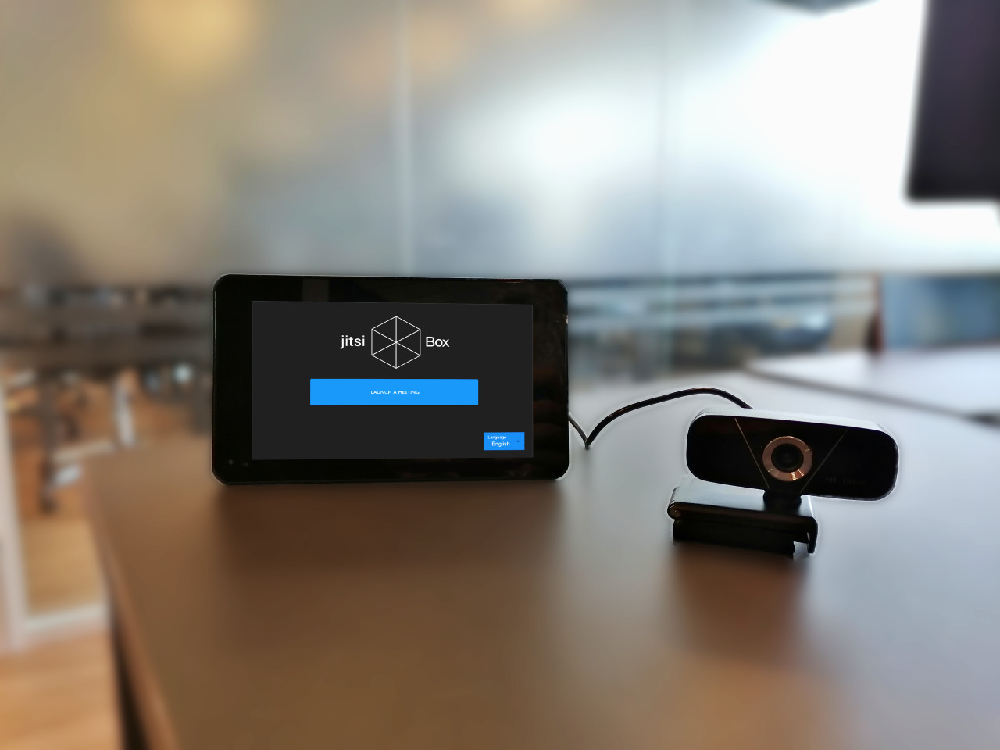

# Jitsi Box

## Jitsi BoxXXXX, an opensource device for hybrid classrooms and conferences

A hybrid classroom combines traditional face-to-face teaching with online teaching.

Our ambition is to blend the virtual classroom with the real classroom through the use of a simple device called the Jitsi-Box.

The Jitsi-Box is a case with an interface which allows teachers to connect their physical classroom to their online teaching meeting.

Ultimately, the idea is to ensure that online students feel as if they were actually in the classroom with easy interactions with their peers in the class and vice-versa.

In order to do that, the Jitsi-Box device can be placed in a classroom (on a wall or desk) and then connected to:

* a sound system to render the sound of the people online
* various cameras dispersed in the room to render the classroom to the people online
* a microphone to take the sound from the classroom
* a TV to see the people online within the classroom

All of these outputs can be chosen by he/she who setups the jitsi-box in a room.

A version of the application is available on https://jitsi-box.com

The application has been configured as a Progressive Web App and can therefore be installed on the desktop of any device.
<<<<<<< HEAD

[Edit](https://github.com/AjaIoa/Homer-test/blob/master/Docusaurus/docs/jitsi/jitsi-box/j-box-.md)
=======
>>>>>>> 823e48374726e97c5e8b27824f9ebf19b289a6e9
